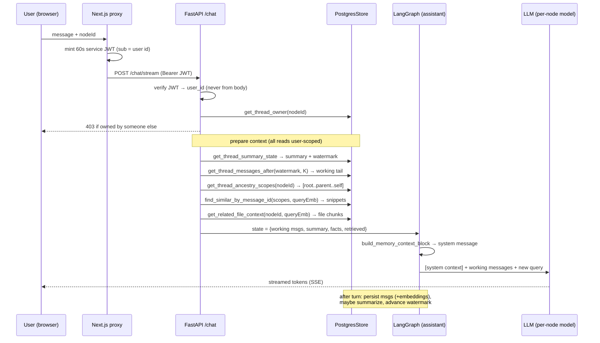
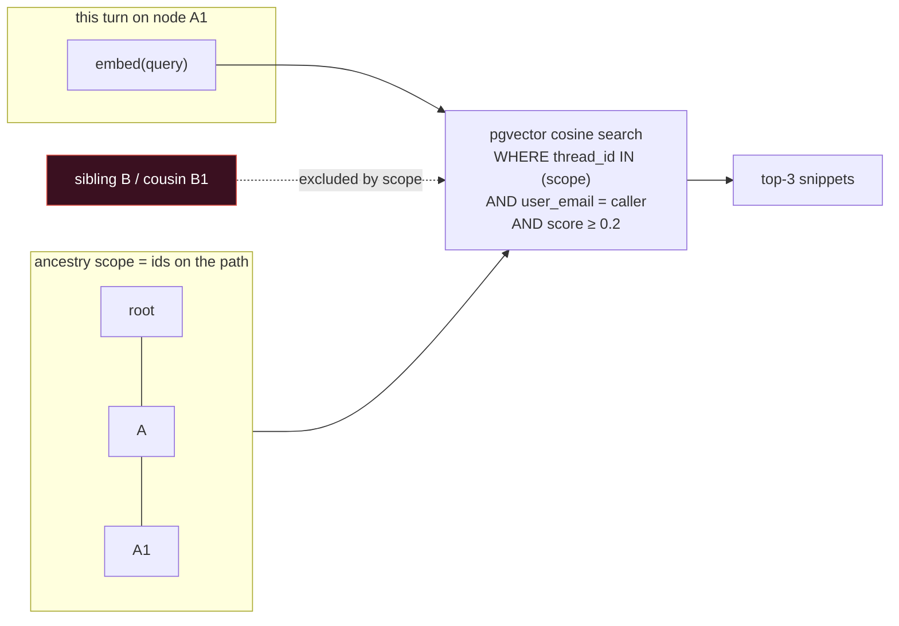
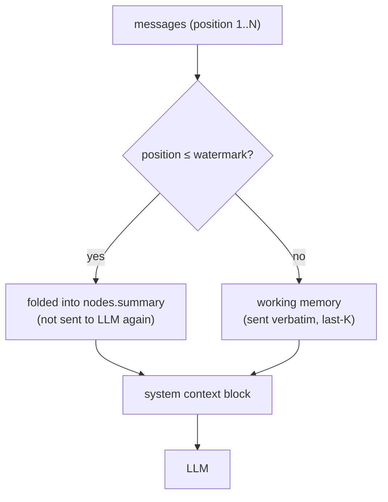

# V2 — Context Engineering (how a branch's prompt is built)

This is the heart of the product: what each node "knows", where every
token comes from, and why a branch never leaks into a sibling. Diagrams
are Mermaid (render in GitHub / Obsidian / VS Code). Everything below is
the **as-built** behavior, traced from the code
(`app/agent/main.py`, `memory.py`, `store/PostgresStore.py`).

---

## 1. The one rule, drawn

A canvas is a forest. Context flows **down a lineage only** — never
sideways to a sibling, never up from a child.

```mermaid
flowchart TD
    R["Root node<br/>GPT-5"] --> A["Node A<br/>Claude"]
    R --> B["Node B<br/>Gemini"]
    A --> A1["Side question<br/>(child of A)"]
    B --> B1["Node B1"]

    R -. "knowledge flows DOWN the lineage" .-> A
    A -. "" .-> A1

    classDef lit fill:#1A4A3A,stroke:#E3A44A,color:#fff;
    classDef dim fill:#10182E,stroke:#26304A,color:#8A92A8;
    class R,A,A1 lit;
    class B,B1 dim;
```

When node **A1** takes a turn, it may draw on **R → A → A1**. It can
never see **B**, **B1**, or a cousin. That boundary is enforced twice:
by *which threads* similarity search is allowed to read (ancestry scope),
and by *tenancy* (every read is user-scoped — a different user's lineage
is invisible even if an id is guessed).

---

## 2. The four memory layers (per node)

Each node carries four kinds of memory. They have different lifetimes and
different token budgets.

| Layer | Lives in | Filled by | Bounded by |
|-------|----------|-----------|------------|
| **Working** | LangGraph state (the live message list) | the raw last-K messages, hydrated from `messages` above the watermark | `KEEP_LAST_MESSAGES` (6) |
| **Episodic** | `nodes.summary` (+ `summarized_up_to_position` watermark) | the summarizer, folding old turns into prose | `MAX_SUMMARY_CHARS` (2400) |
| **Semantic** | `nodes.data.memoryFacts` (JSON) | fact extraction after turns | small JSON |
| **Retrieved** | computed fresh each turn (not stored) | pgvector similarity over the **ancestry** + file chunks | `SIMILAR_CONTEXT_LIMIT` (3) + `FILE_CONTEXT_LIMIT` (3) |

---

## 3. What happens on a single turn



---

## 4. How the prompt is assembled (the exact block)

`build_memory_context_block` (memory.py:142) prepends ONE system message,
then the working messages follow. Structure, in order:

```
Internal background context for continuity. Use only when relevant…
<THREAD_SUMMARY>      ← Episodic: nodes.summary (folded older turns)
   …rolling summary of everything past the watermark…
</THREAD_SUMMARY>
<MEMORY_FACTS>        ← Semantic: durable facts (name, preferences, …)
   …compact JSON facts…
</MEMORY_FACTS>
<RELEVANT_CONTEXT>    ← Retrieved: ancestry-scoped similarity hits
   [sim 1 | role=user  | score=0.83] id=…: <snippet>
   [sim 2 | role=assistant | score=0.71] id=…: <snippet>
</RELEVANT_CONTEXT>
<EXTERNAL_CONTEXT>    ← Retrieved: file/Codex chunks (RAG)
   [file 1 | spec.md | chunk=3] <snippet>
</EXTERNAL_CONTEXT>
```

Then the LLM receives:

```
[ system: the block above ]
[ working messages: last-K verbatim turns above the watermark ]
[ human: the new query ]
```

Token discipline: every piece is clipped before assembly —
summary ≤2400 chars, each similarity snippet ≤320, each file chunk ≤900.
This is what keeps a deep branch's prompt small (the cost story): you send
a *summary + a few snippets*, not the entire linear history.

---

## 5. Scoped retrieval — why siblings never leak



`get_thread_ancestry_scopes(thread_id)` returns the materialized
`ancestor_ids` path (root → … → self). `find_similar_by_message_id`
searches **only** those threads, and (V2) only rows owned by the caller.
Two independent fences: lineage and tenant.

---

## 6. Summarization — the watermark

When a node exceeds `MAX_MESSAGES_BEFORE_SUMMARY` (10) turns, the
summarizer folds the oldest messages into `nodes.summary` and advances
`summarized_up_to_position`. Messages at or below the watermark stay in
the DB (the UI still renders them) but are **never re-fed** into the LLM —
their meaning now lives in the summary.



Watermark only moves forward (`GREATEST(existing, new)`), so an
out-of-order summarize can never rewind it.

---

## 7. Forking — a branch starts with inherited knowledge, not state

On the first message to a new branch, `_init_fork_if_needed` seeds it
from the parent **at the fork point** (not the parent's current state):

```mermaid
flowchart TD
    P["parent lineage up to fork message"] --> split{"split at fork point"}
    split -->|older msgs| resum["LLM re-summarize → new node's summary"]
    split -->|last FORK_BUFFER (2)| buf["copied verbatim into new node"]
    P --> facts["memory facts inherited"]
    resum --> new["new branch node<br/>(is_initialized=true)"]
    buf --> new
    facts --> new
    new --> go["normal turn proceeds"]
```

The whole write is one transaction under an advisory lock keyed on the
new thread id, so two racing first-messages can't double-init.

---

## 8. V2 changes to this design (what we are building on top)

| Change | Effect on context engineering |
|--------|-------------------------------|
| **Tenancy scoping (done, Day 5)** | Every retrieval/read carries `user_email`; the ancestry fence is now paired with a tenant fence. Cross-user leakage is impossible even with a guessed id. |
| **Codex cards (F2, Week 2)** | Pinned context cards become first-class `<EXTERNAL_CONTEXT>` sources, attached per node and inherited at fork — same injection path as file chunks. |
| **Context inspector (F4)** | The exact assembled block (this doc's §4) is shown read-only in the console "Context" tab — the honesty organ: what the model actually got, with per-block token counts. |
| **Cost meter (F4)** | Token counts of each block × model price = the "saved vs one linear chat" number. Scoped context is the *reason* the number is small. |
| **Per-node model (F0a/F5)** | The same assembled context can be handed to any provider; "continue on another AI" = re-run this pipeline with a different model, context unchanged. |
| **user_id migration (done)** | Reads currently resolve `user_id → user_email` for the predicate; the store sweep (Day 6) will switch predicates to `user_id` directly once the interim Next.js writer is retired. |

---

## 9. One-paragraph summary (for the pitch)

Every branch builds its prompt from four layers — a rolling **summary** of
older turns, durable **facts**, the **last few messages** verbatim, and a
handful of **semantically-retrieved snippets** drawn only from its own
ancestry. Old turns are folded into the summary behind a watermark and
never resent. The result: a deep conversation costs a *summary plus a few
snippets* per turn instead of the whole history — cheaper on your own API
key, and structurally incapable of leaking a sibling branch's context or
another user's data.
```
